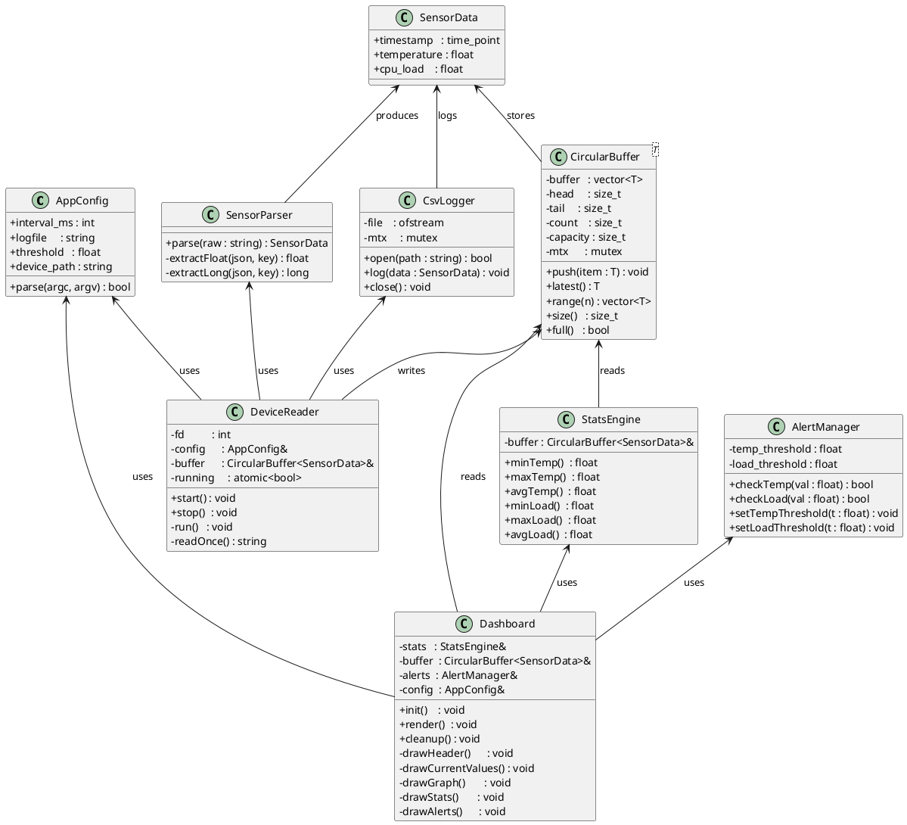
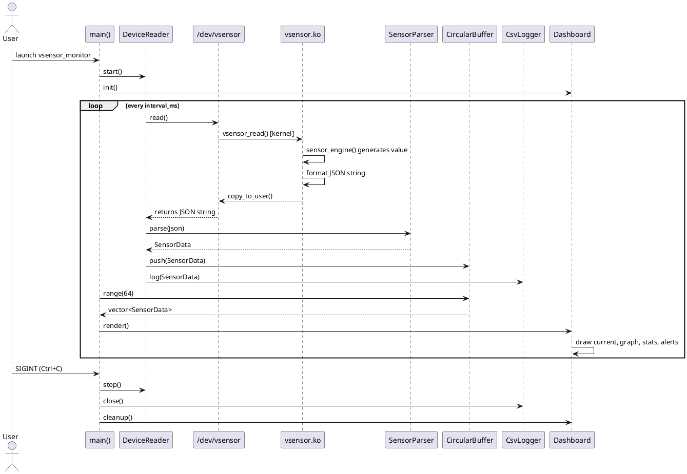
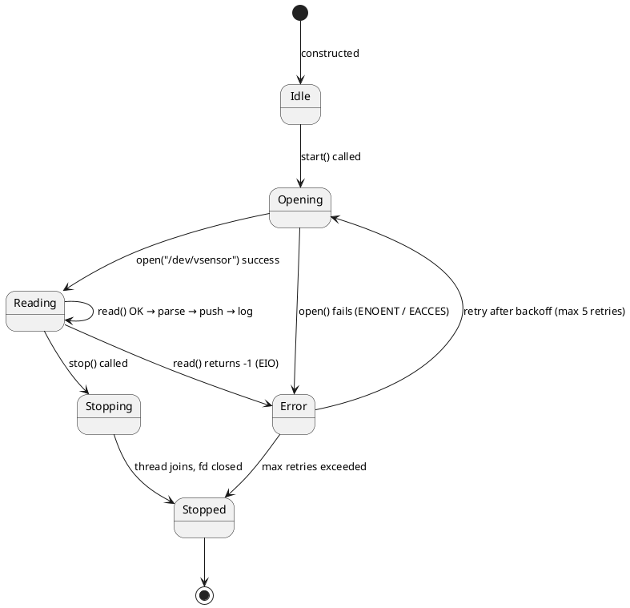
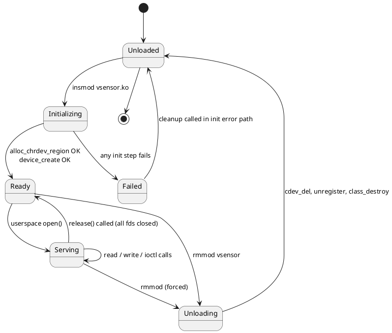

# Stage 3 – UML Diagrams

All diagrams are written in PlantUML syntax. Render them at https://www.plantuml.com/plantuml

---

## 1. Class Diagram

---

## 2. Sequence Diagram – Normal Read Cycle

---

## 3. State Machine Diagram – DeviceReader

---

## 4. State Machine Diagram – Kernel Module Lifecycle

